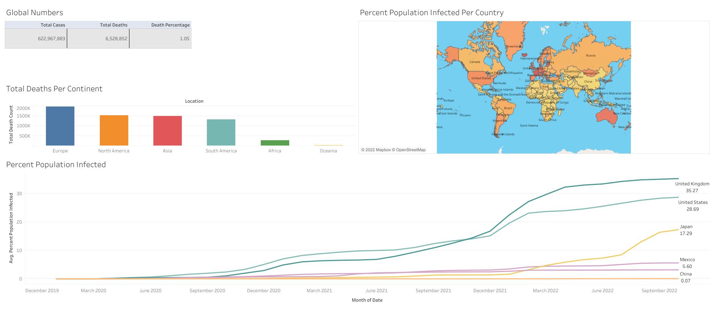

# SQL Mini Project Using Covid Data
## Motivation
This project was inspired by Alex the Analyst. The goal is to use SQL to do exploratory analyst as well as create visualizations from SQL queries. 

## Data Tools
The queries were done in Google Big Query(GBQ) and the data was downloaded from https://ourworldindata.org/covid-deaths. The data is also included into this repository as the downloaded data acquired from link will pull the full dataset from the beginning of the pandemic until the day that the information is pulled. The file in this repository spans from 2/3/2020 to 10/17/2022.

NOTE about GBQ: Due to using GBQ, there were some tweaks that had to be made since in the video, Microsoft SQL Server was used. The way that data gets imported to GBQ is different and the covid file was fairly sizeable. Due to the size of the file, it was unable to open in google sheets or free online excel. I would highly recommend using whatever SQL server tool is at your disposal. 

## Data Understanding
The queries that are given show interesting information. These two pictures are a snippet of the some of information that can come from the SQL queries.

In the first image, it shows the total infection percentage of the US. It was done by taking the total cases and dividing it by the population. The result shows that the US has as of this 10/17, an ~28.77 total infection rate. 

The second image shows the total death percentage for all global cases. It took an accumulation of all of the new cases (daily) and dividing it by an accumulation of all of the new deaths (daily). That percentage stands at ~1%

## Dashboard Using SQL Queries
After gathering information from the queries, a few queries were used to be able to visualize the information on a dashboard using Tableau Desktop.

[Queries used](/queries_for_tableau.sql)

This was how the finished dashboard looked like.

The Dashboard consisted of a text table, bar chart, map and line chart. The SQL queries were used to pull up the results needed to input into the Dashboard. Each visualization was created on a different sheet in Tableau and then combined into the Dashboard. 

Since I used GBQ, the way to get the results into a sheet was to export it directly from GBQ and save it to my local drive to input into Tableau.

NOTE about Tableau: Tableau public has both an online version and a desktop version. In order to be able to create this dashboard, it was much easier to use Tableau desktop as importing files into the Tableau online was quite challenging. 

If you'd like to take a look at the interactivity of the dashboard, you can click on the "Interactive Dashboard" link below.

[Interactive Dashboard](https://public.tableau.com/app/profile/jonathan.roman/viz/CovidDashboard_16662963818250/Dashboard1?publish=yes)

## References

[Data Analyst Portfolio Project | SQL Data Exploration - Alex The Analyst](https://www.youtube.com/watch?v=qfyynHBFOsM&list=WL&index=4)

[Data Analyst Portfolio Project | Tableau Visualization - Alex The Analyst](https://www.youtube.com/watch?v=QILNlRvJlfQ&list=WL&index=3)
